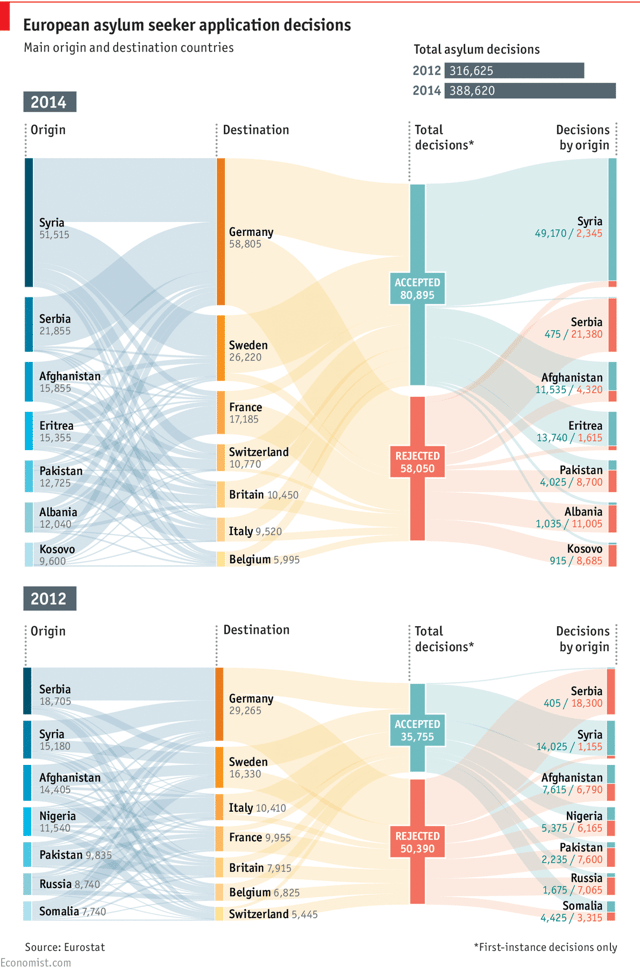

# Data Visualization

## Assignment 2: Good and Bad Data Visualization

### Requirements:

- Data visualizations are important tools for communication and convincing; we need to be able to evaluate the ways that data are presented in visual form to be critical consumers of information 
- To test your evaluation skills, locate two public data visualizations online, one good and one bad  
    - You can find data visualizations at https://public.tableau.com/app/discover or https://datavizproject.com/, or anywhere else you like!

    - 
    - 
    
- For each visualization (good and bad):  
    - Explain (with reference to material covered up to date, along with readings and other scholarly sources, as needed) why you classified that visualization the way you did.
      ```
      1. Good Visualization: Seeking Safety - European Asylum Application Flows
        Link: [The Economist](https://www.economist.com/graphic-detail/2015/05/12/seeking-safety)

        1.1 Clear Display: Identifies major asylum applicant countries clearly.

        1.2 Acceptance and Rejection Ratios: Clearly shows success rates for each country.

        1.3 Explicit Proportions: Facilitates intuitive comparisons with clear proportions.
        
        1.4 Annual Comparison: Enables comparison of asylum data between 2012 and 2014 to observe trends.
        
        Summary: The visualization provides a clear and intuitive view of major applicant countries, their acceptance and rejection ratios, and allows for effective year-to-year comparisons. Its strengths are in its vivid representation and insightful data comparison.

      2. Bad Visualization: Foreigners in Milan
        Link: [flickr.com](https://www.flickr.com/photos/densitydesign/8089717433/in/album-72157631774207511/)

        Description: The map shows foreign residents in Milan, with balloon size indicating population and color representing the percentage of foreigners.

        Issues:

        2.1 Information Overload: The map is cluttered with numerous balloons of varying sizes, increasing cognitive load and making it difficult to interpret and analyze the data effectively.

        2.2 Increase Cognitive Load: Balloon size represents the number of people rather than the percentage of foreigners. As a result, a balloon for 7.5% may be larger than one for 8.9%, creating confusion between balloon size and the percentage of foreigners shown.

        2.3 Lack of Geographic Detail: The map oversimplifies geographic features, missing important contextual details like streets and landmarks. Despite the many balloons, the simplified map lacks critical geographic context that could aid in understanding the data distribution and its relation to real-world locations.

      ```
    - How could this data visualization have been improved?  
      ```
      1. Good Visualization:

        1.1 Change Label: The total asylum decisions for 2012 and 2014 do not match the sum of accepted and rejected decisions, leading to ambiguity. Clarify this by listing major countries' application numbers and their percentages of total applications.

        1.2 Decrease Cognitive Load: Varying the country order between 2012 and 2014 increases cognitive load, making data comparison more difficult. To improve this, maintain a consistent country order across years for easier and more accurate comparison.

        1.3 Include Data Source: Adding the source of the data enhances credibility and allows users to verify the information, leading to greater trust and understanding of the visualization.

      2. Bad Visualization:

        2.1 Simplify Visualization: Reduce the information density by merging similar areas and decreasing the number of bubbles. For instance, only display major regions or use aggregated bubbles to minimize visual clutter, making the map easier to understand.

        2.2 Faceted Plot: Use multiple small plots to show data for different regions. Divide the map into administrative or regional areas, with each small plot displaying the proportion of foreigners and total population. This approach helps avoid information overload and allows for more detailed comparisons.

        2.3 Stacked Bar Chart: Add a stacked bar chart next to the map to display the proportion of foreigners in each region. This additional chart provides an extra layer of information, aiding users in better understanding the data and comparing it with the map information.
      
      ```

- Word count should not exceed (as a maximum) 500 words for each visualization (i.e. 
300 words for your good example and 500 for your bad example)

### Why am I doing this assignment?:

- This assignment ensures active participation in the course, and assesses the learning outcomes
* Apply general design principles to create accessible and equitable data visualizations
* Use data visualization to tell a story

### Rubric:

| Component               | Scoring   | Requirement                                                 |
|-------------------------|-----------|-------------------------------------------------------------|
| Data viz classification and justification | Complete/Incomplete | - Data viz are clearly classified as good or bad<br />- At least three reasons for each classification are provided<br />- Reasoning is supported by course content or scholarly sources |
| Suggested improvements  | Complete/Incomplete | - At least two suggestions for improvement<br />- Suggestions are supported by course content or scholarly sources |

## Submission Information

🚨 **Please review our [Assignment Submission Guide](https://github.com/UofT-DSI/onboarding/blob/main/onboarding_documents/submissions.md)** 🚨 for detailed instructions on how to format, branch, and submit your work. Following these guidelines is crucial for your submissions to be evaluated correctly.

### Submission Parameters:
* Submission Due Date: `HH:MM AM/PM - DD/MM/YYYY`
* The branch name for your repo should be: `assignment-2`
* What to submit for this assignment:
    * This markdown file (assignment_2.md) should be populated and should be the only change in your pull request.
* What the pull request link should look like for this assignment: `https://github.com/<your_github_username>/visualization/pull/<pr_id>`
    * Open a private window in your browser. Copy and paste the link to your pull request into the address bar. Make sure you can see your pull request properly. This helps the technical facilitator and learning support staff review your submission easily.

Checklist:
- [ ] Create a branch called `assignment-2`.
- [ ] Ensure that the repository is public.
- [ ] Review [the PR description guidelines](https://github.com/UofT-DSI/onboarding/blob/main/onboarding_documents/submissions.md#guidelines-for-pull-request-descriptions) and adhere to them.
- [ ] Verify that the link is accessible in a private browser window.

If you encounter any difficulties or have questions, please don't hesitate to reach out to our team via our Slack at `#cohort-3-help`. Our Technical Facilitators and Learning Support staff are here to help you navigate any challenges.
